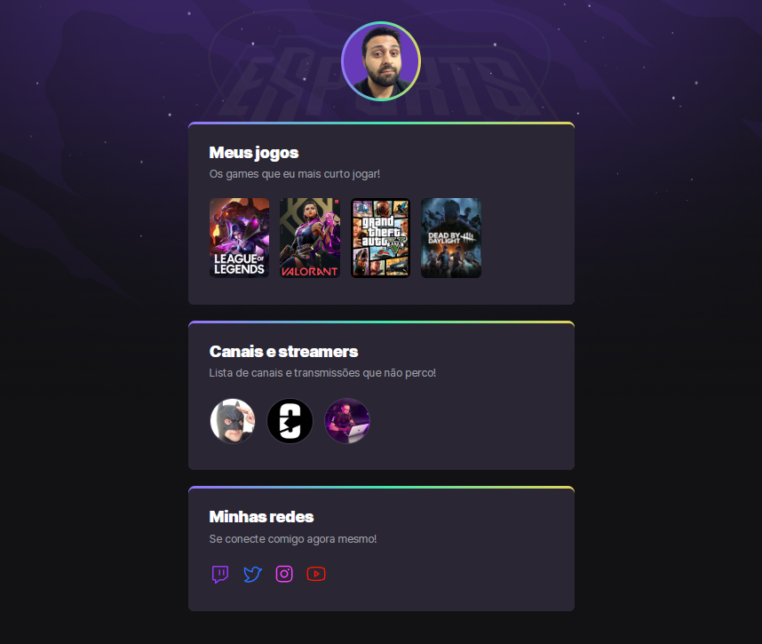

# NLW eSports 🎮

> Tilha Explorer

## 📝 Descrição

---

Projeto cronstruído do evento Next Level da Rocketseat.

🔗 [Clique aqui para acessar](https://antoniodamous.github.io/nlw-esports-explorer/)

## 🛠 Tecnologias

---

Esse projeto foi desenvolvido com as seguintes tecnologias:

- HTML
- CSS
- Git e Github

## 🙇🏻‍♂️ Apredizado

---

- Estrutura básica HTML
- Reset css
- Espaçamento
- Conceito e visualização de caixa (interna e uma ao lado da outra)
- Inserir e trabalhar com imagem
- Trabalho com texto
- Keyframes
- Animações em CSS

---

## 📚 Bibliotecas

---

- [Google Fonts](https://fonts.google.com/)

## 🔗 Links

---

 
 
  
 

 

 
## 💻 Autor 
---
<table>
  <tr>
    

      
    </td>
  </tr>
</table>

<h3 align="center"> Developed by <a href="https://www.linkedin.com/in/antoniodamous/">Antônio Damous</a> ☕</h3>
